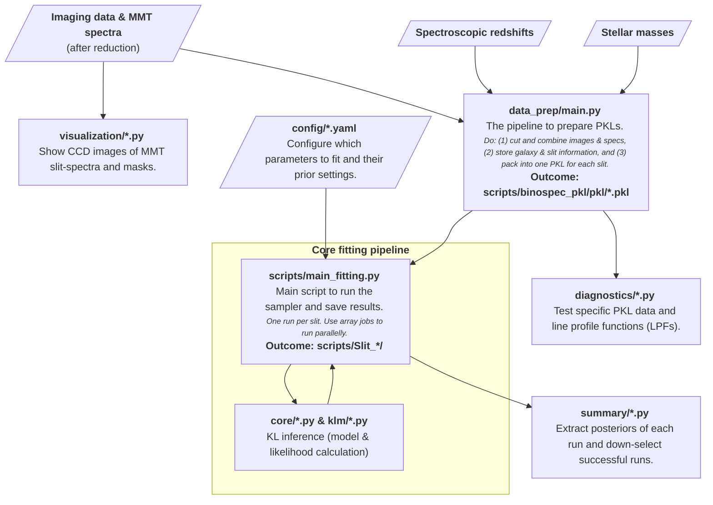

## To install, clone and change your working directory to this repo level. Run
```
pip install -e .
```

## To run, find this code
Go to `scripts` > `main_fitting.py`. This is where I start the fitting. 

If running other Python scripts, it may require extra metadata (e.g., raw imaging or spectrum data), and these files are over 1 GB, which exceeds my GitHub storage limit.

Module Architecture Diagram:


## Copyright hints
The folder `klm` was originally from Pranjal's `kl_measurement` [GitHub repo](https://github.com/emhuff/kl_measurement/tree/manga/klm) (ask Eric for access), and some code was modified for my preferences. Other codes are mine. Happy to take questions!
